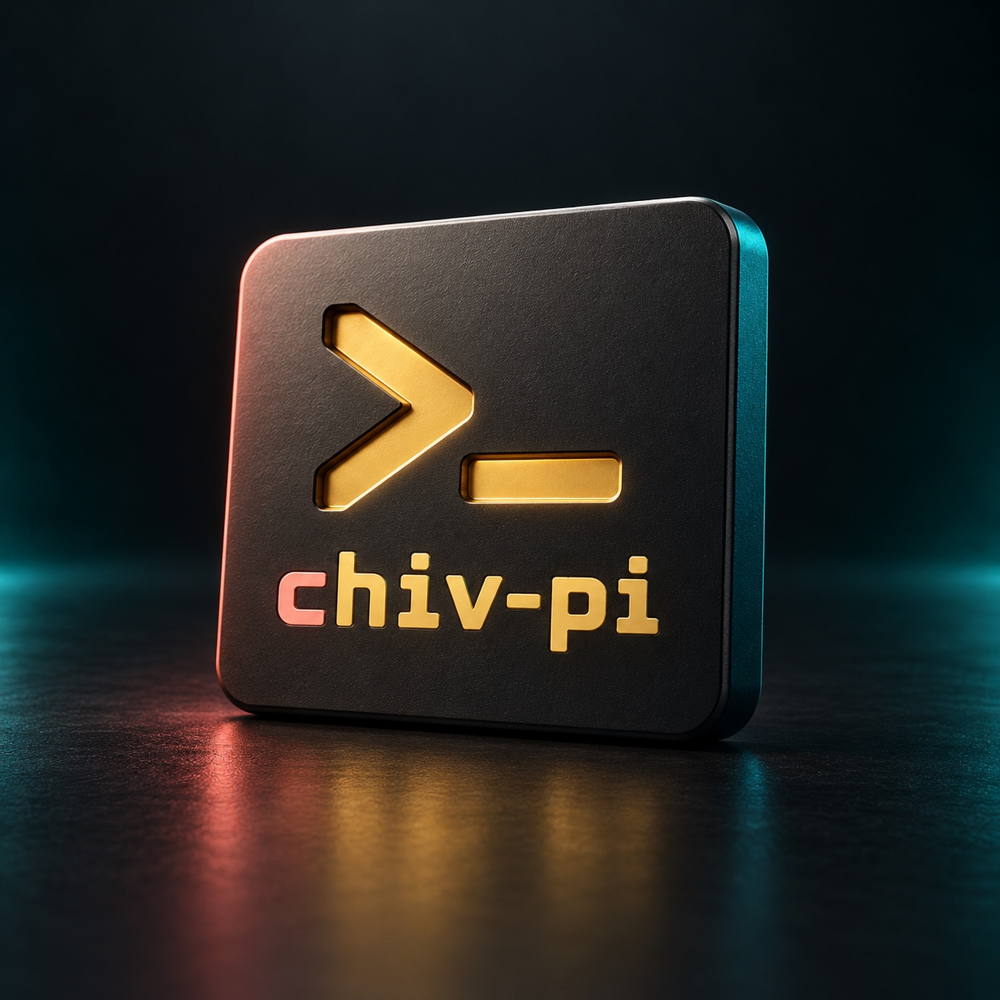

<p align="center">
  
</p>

# chiv-pi

chiv-pi 是基于 [Pi v1.0.0](https://github.com/earendil-works/pi/tree/v1.0.0) 改造的终端 AI 编程助手，支持文件读写、命令执行、会话管理、模型切换和扩展。

当前阶段完成应用品牌与源码入口定制。独立 npm 包 [`@chivopic/chiv-pi`](https://www.npmjs.com/package/@chivopic/chiv-pi) 已发布，首个版本为 `1.0.0`；内部源码包名和托管服务仍沿用上游。上游 npm 包与安装器安装的是 Pi。

## 快速开始

通过 npm 安装并启动：

```bash
npm install -g --ignore-scripts @chivopic/chiv-pi
cd /path/to/your/project
chiv-pi
```

在终端中运行 `/login` 连接模型服务，用 `/model` 选择模型，然后直接输入任务。

## 功能与界面

- 读取、修改项目文件，并运行命令验证结果。
- 切换模型，继续或分支会话。
- 通过技能、扩展和 MCP 定制工作流。
- 使用 print、JSON、RPC 模式或 TypeScript SDK 集成到脚本和应用。

以下是已发布的 `chiv-pi v1.0.0` 读取示例代码并回复时的真实终端画面：


使用 `/model` 选择已配置服务商的模型：


## 品牌视觉

字标沿用 CLI 的珊瑚色首字母与暖金色文字。这张终端提示符概念渲染用于展示品牌视觉：

<p align="center">
  
</p>

图片来源与制作说明见 [视觉素材](packages/coding-agent/docs/branding.md)。使用说明见 [终端操作](packages/coding-agent/docs/usage.md)、[模型选择](packages/coding-agent/docs/models.md) 和 [会话管理](packages/coding-agent/docs/sessions.md)。发布流程见 [npm 发布说明](packages/coding-agent/docs/npm-release.md)。

## 本地启动

需要 Node.js 22.19 或更新版本。在仓库根目录安装依赖并启动：

```bash
npm install --ignore-scripts
npm run hydrate:model-data
npm start
```

也可以从任意工作目录调用源码入口，它会保留调用时的工作目录：

```bash
/path/to/chiv-pi/chiv-pi
/path/to/chiv-pi/chiv-pi --help
```

启动后使用 `/login` 配置模型服务，或设置服务商对应的 API key 环境变量。

## 配置与会话

| 用途 | 路径或环境变量 |
|------|----------------|
| 用户配置、凭据和资源 | `~/.chiv-pi/agent/` |
| 项目配置和资源 | `<项目>/.chiv-pi/` |
| 用户配置目录覆盖 | `CHIV_PI_CODING_AGENT_DIR` |
| 会话目录覆盖 | `CHIV_PI_CODING_AGENT_SESSION_DIR` |
| 子进程标记 | `AI_AGENT=chiv-pi`、`CHIV_PI_CODING_AGENT=true` |

chiv-pi 使用独立配置目录，不会自动读取 `~/.pi/agent` 或项目中的 `.pi` 资源。需要的设置和扩展应放入对应的 `.chiv-pi` 目录。

## Packages

* **[@earendil-works/pi-coding-agent](packages/coding-agent)**: chiv-pi CLI and SDK; the internal package ID retains its upstream name
* **[@earendil-works/pi-agent-core](packages/agent)**: Agent runtime with tool calling and state management
* **[@earendil-works/pi-ai](packages/ai)**: Unified multi-provider LLM API (OpenAI, Anthropic, Google, …)

Upstream Pi references:

* [Visit pi.dev](https://pi.dev), the project website with demos
* [Read the documentation](https://pi.dev/docs/latest), but you can also ask the agent to explain itself

## All Packages

| Package | Description |
|---------|-------------|
| **[@earendil-works/chord](packages/chord)** | Standalone application-composition runtime for services, replicated state, RPC, and plugins |
| **[@earendil-works/pi-telemetry](packages/telemetry)** | Vendor-neutral telemetry contracts, reference adapter, conformance tests, and typed schemas |
| **[@earendil-works/pi-ai](packages/ai)** | Unified multi-provider LLM API (OpenAI, Anthropic, Google, etc.) |
| **[@earendil-works/pi-durable](packages/durable)** | Durable conversation, task, and document runtime |
| **[@earendil-works/pi-agent-core](packages/agent)** | Agent runtime with tool calling and state management |
| **[@earendil-works/pi-coding-agent](packages/coding-agent)** | Interactive coding agent CLI |
| **[@earendil-works/pi-tui](packages/tui)** | Terminal UI library with differential rendering |

For Slack/chat automation and workflows see [earendil-works/pi-chat](https://github.com/earendil-works/pi-chat).

## Permissions & Containerization

Pi does not include a built-in permission system for restricting filesystem, process, network, or credential access. By default, it runs with the permissions of the user and process that launched it.

If you need stronger boundaries, containerize or sandbox Pi. See [packages/coding-agent/docs/containerization.md](packages/coding-agent/docs/containerization.md) for three patterns:

- **Gondolin extension**: keep `pi` and provider auth on the host while routing built-in tools and `!` commands into a local Linux micro-VM.
- **Plain Docker**: run the whole `pi` process in a local container for simple isolation.
- **OpenShell**: run the whole `pi` process in a policy-controlled sandbox.

## Contributing

See [CONTRIBUTING.md](CONTRIBUTING.md) for contribution guidelines and [AGENTS.md](AGENTS.md) for project-specific rules (for both humans and agents).  Longer term plans for Pi can also be found in [RFCs](https://rfc.earendil.com/keyword/pi/).

## Development

```bash
npm install --ignore-scripts  # Install all dependencies without running lifecycle scripts
npm run hydrate:model-data  # Fetch the model catalog required to run from source
npm run build         # Refresh model data, then build all packages
npm run build:offline # Rebuild using existing model data without network access
npm run check         # Lint, format, and type check
./test.sh            # Run tests (skips LLM-dependent tests without API keys)
./pi-test.sh         # Run pi from sources (can be run from any directory)
```

## Building upstream standalone binaries from release source

GitHub releases include a versioned source archive covered by the release's `SHA256SUMS` file. Extract it and run the same build script used for the official standalone binaries:

```bash
VERSION="<release-version>"
tar -xzf "pi-${VERSION}-source.tar.gz"
cd "pi-${VERSION}"
./scripts/build-binaries.sh --offline-model-data --platform linux-x64 --out "$PWD/out"
```

The archive includes release model data and native prebuilds. `--offline-model-data` uses that model data without refreshing provider catalogs. The script installs dependencies and builds the executable with its runtime assets; pass `--skip-install` if dependencies are already provided.

## Supply-chain hardening

We treat npm dependency changes as reviewed code changes.

- Direct external dependencies are pinned to exact versions. Internal workspace packages remain version-ranged.
- `.npmrc` sets `save-exact=true` and `min-release-age=2` to avoid same-day dependency releases during npm resolution.
- `package-lock.json` is the dependency ground truth. Pre-commit blocks accidental lockfile commits unless `PI_ALLOW_LOCKFILE_CHANGE=1` is set.
- `npm run check` verifies pinned direct deps, native TypeScript import compatibility, and the generated coding-agent shrinkwrap.
- The published CLI package includes `packages/coding-agent/npm-shrinkwrap.json`, generated from the root lockfile, to pin transitive deps for npm users.
- Release smoke tests use `npm run release:local` to build, pack, and create isolated npm and Bun installs outside the repo before tagging a release.
- Local release installs, documented npm installs, and `pi update --self` use `--ignore-scripts` where supported.
- CI installs with `npm ci --ignore-scripts`, and a scheduled GitHub workflow runs `npm audit --omit=dev` plus `npm audit signatures --omit=dev`.
- Shrinkwrap generation has an explicit allowlist for dependency lifecycle scripts; new lifecycle-script deps fail checks until reviewed.

## Share your OSS coding agent sessions

If you use Pi or other coding agents for open source work, please share your sessions.

Public OSS session data helps improve coding agents with real-world tasks, tool use, failures, and fixes instead of toy benchmarks.

For the full explanation, see [this post on X](https://x.com/badlogicgames/status/2037811643774652911).

To publish sessions, use [`badlogic/pi-share-hf`](https://github.com/badlogic/pi-share-hf). Read its README.md for setup instructions. All you need is a Hugging Face account, the Hugging Face CLI, and `pi-share-hf`.

You can also watch [this video](https://x.com/badlogicgames/status/2041151967695634619), where I show how I publish my `pi-mono` sessions.

I regularly publish my own `pi-mono` work sessions here:

- [badlogicgames/pi-mono on Hugging Face](https://huggingface.co/datasets/badlogicgames/pi-mono)

## License

MIT. Based on [earendil-works/pi](https://github.com/earendil-works/pi); see [LICENSE](LICENSE) for the original copyright notice.

<p align="center">
  <a href="https://pi.dev">pi.dev</a> domain graciously donated by
  <br /><br />
  <a href="https://exe.dev"><br />exe.dev</a>
</p>
