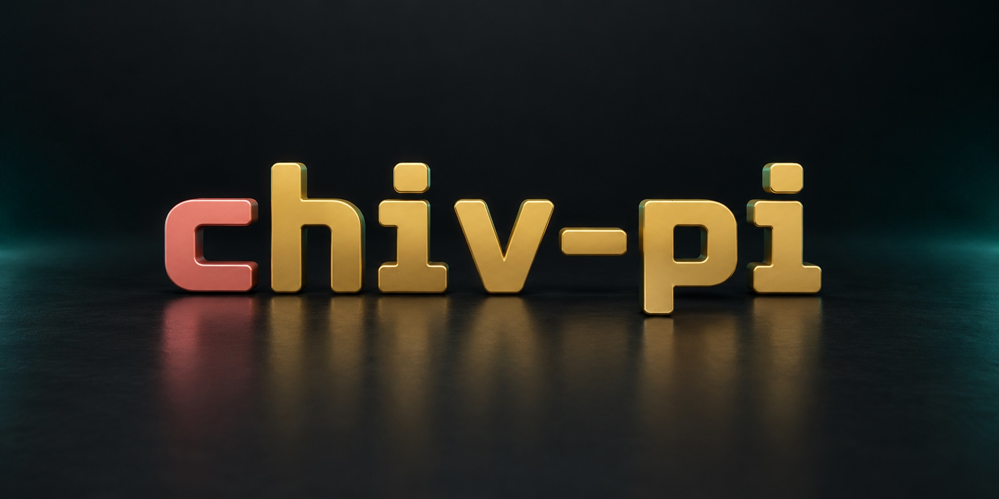
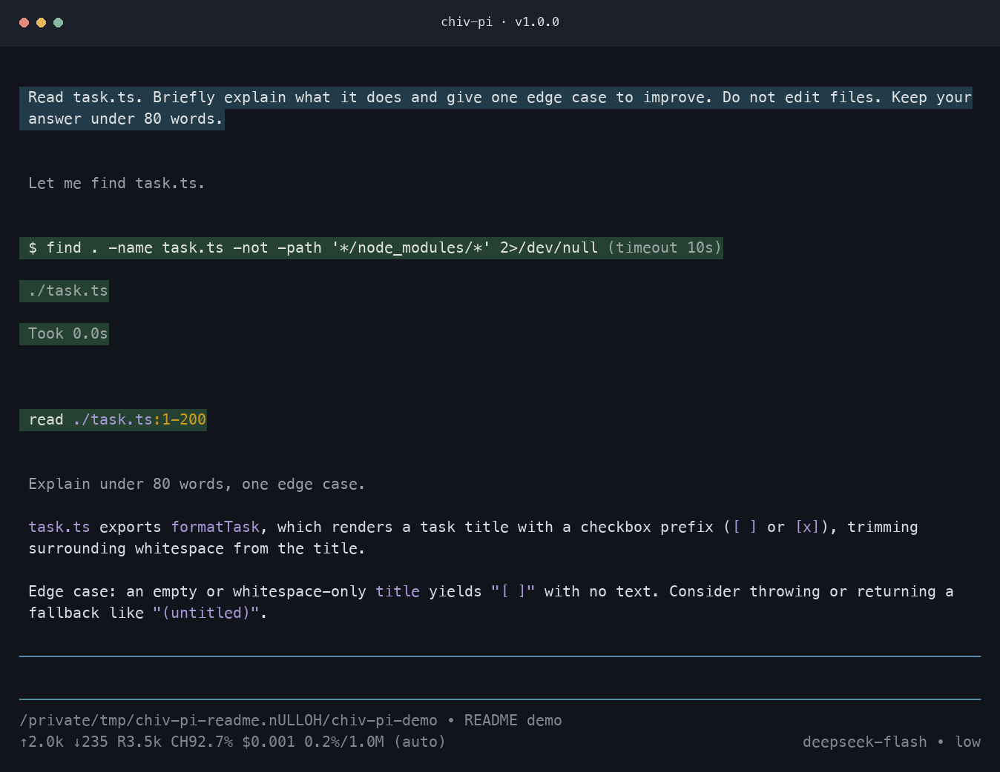
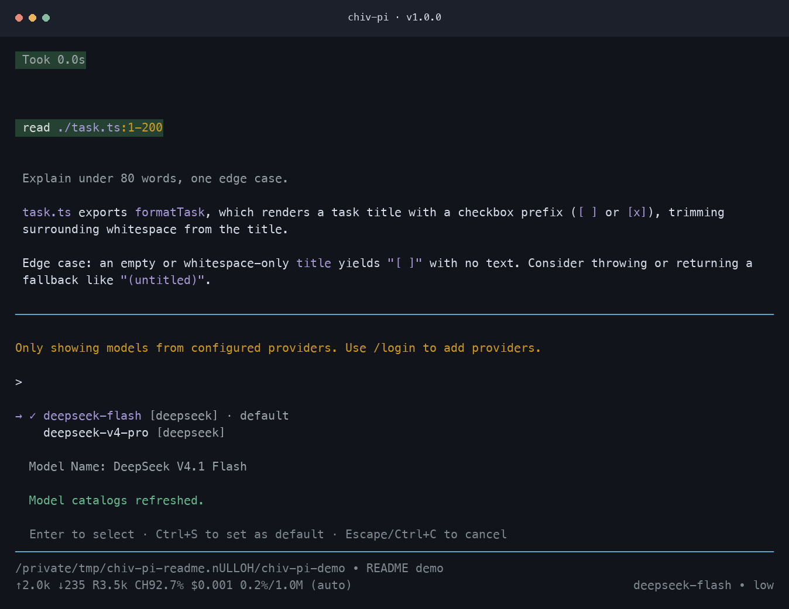

<p align="center">
  
</p>

# chiv-pi

chiv-pi is a terminal AI coding agent based on [Pi v1.0.0](https://github.com/earendil-works/pi/tree/v1.0.0).

Ask chiv-pi to create the prompt templates, skills, extensions, and themes you need, or install an extension package. Use it directly, automate it in print, JSON, or RPC mode, or build applications with the TypeScript SDK.

## Getting started

From the repository root, install dependencies and start the source CLI:

```bash
npm install --ignore-scripts
npm run hydrate:model-data
npm start
```

This requires Node.js 22.19 or newer. Dependency lifecycle scripts are not needed.

On macOS or Linux, call the source launcher from your project directory:

```bash
cd /path/to/project
/path/to/chiv-pi/chiv-pi
```

The public npm package is [`@chivopic/chiv-pi`](https://www.npmjs.com/package/@chivopic/chiv-pi), starting at version `1.0.0`. Install and run it from your project directory:

```bash
npm install -g --ignore-scripts @chivopic/chiv-pi
chiv-pi
```

See [npm release instructions](docs/npm-release.md). This fork retains the internal `@earendil-works/*` workspace names and upstream hosted services. Public upstream packages and installers install Pi.

Run `/login` inside chiv-pi to connect a subscription or API key, then give it a task.

User settings, credentials, sessions, and resources live in `~/.chiv-pi/agent/`. Project resources live in `.chiv-pi/`. Override these locations with `CHIV_PI_CODING_AGENT_DIR` and `CHIV_PI_CODING_AGENT_SESSION_DIR`. Existing `.pi` configuration is not loaded automatically.

See the [documentation](docs/index.md) for full setup and usage instructions.

## Preview

The published `chiv-pi v1.0.0` CLI reading a sample file and explaining its code:



Choose a model from a configured provider with `/model`:



The [brand renders and capture notes](docs/branding.md) describe the visual assets. Use the [terminal guide](docs/usage.md) for interactive features.

## Development

From this checkout, run chiv-pi from source:

```bash
npm install --ignore-scripts
npm run hydrate:model-data
./chiv-pi
```

`chiv-pi` can be called from any directory and preserves the caller's working directory. `pi-test.sh` remains the upstream experimental development entry point.

Before submitting changes, run:

```bash
npm run check
./test.sh
```

Read [CONTRIBUTING.md](https://github.com/earendil-works/pi/blob/main/CONTRIBUTING.md) before opening an issue or pull request. It defines the contribution gate, issue quality bar, and required checks. Read [AGENTS.md](https://github.com/earendil-works/pi/blob/main/AGENTS.md) for repository-specific implementation, testing, dependency, and release rules.

## License

MIT
